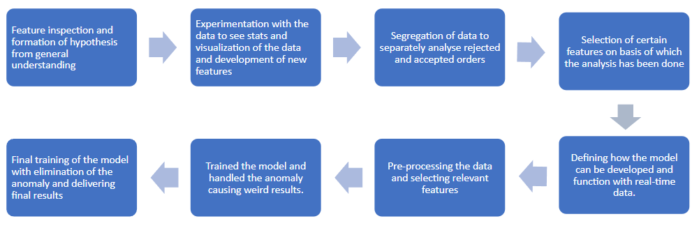

# Swiggy Case Study – DE Rejection

**The case study is aimed to deliver unparalleled customer service by reducing the rejection rates of the delivery partners given the data of past orders for 8 customer regions and delivery partners’ information using machine learning.**

This is the pipeline that I developed to analyse the given data and build model.

